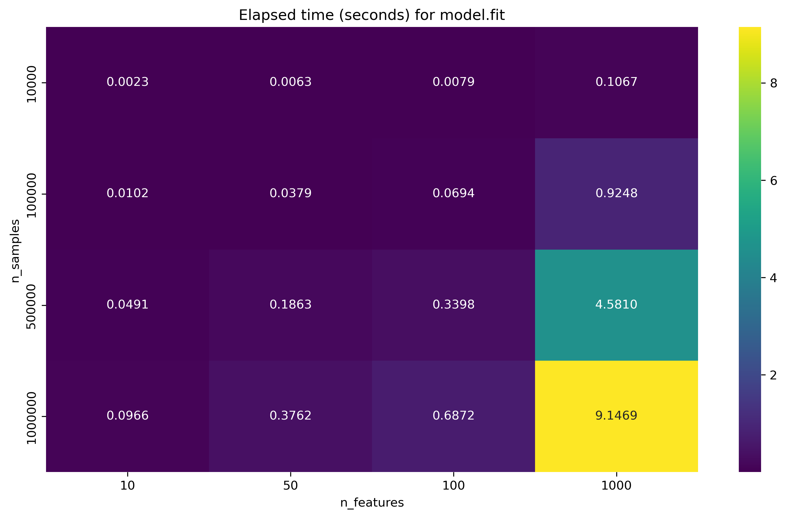

# Assignment 1

## Goal

Benchmark the computational cost of fitting a linear regression model for varying data sizes and feature counts using a simple and naive implementation, and analyze how runtime scales with problem size.

## How to Run

1. Submit the job to the scheduler:
   ```bash
   sbatch launch_job.sh
   ```

2. Check the output and error files:
   - `assignment1.out` - Standard output
   - `assignment1.err` - Standard error

3. Monitor job status:
   ```bash
   squeue -u $USER
   ```

## Benchmark Setup

This job was submitted with the resources specified in `launch_job.sh`:

- Nodes: 1
- Tasks: 1
- CPUs per task: 8
- Memory per node: 32000 MB
- Time limit: 00:05:00
- Partition/QoS/account: batch / low / students


All combinations of the specified sample sizes and feature counts are automatically benchmarked in the script `benchmark_linear_regression.py`. This script iterates over each pair of `(n_samples, n_features)`, fits the model, and records the elapsed time for each configuration in a CSV file (`benchmark_results.csv`).

The benchmark script uses `gc.collect()` to explicitly trigger Python's garbage collector after each fit. This helps free memory from large temporary arrays (such as $X$, $y$, and model parameters) before the next benchmark iteration, reducing the risk of memory exhaustion when running many large fits in sequence.

### Linear regression implementation

The benchmark uses a custom `LinearRegression` (see `linear_regression_complete.py`) that fits parameters by solving the normal equations (X^T X beta = X^T y) with `numpy.linalg.solve`.

## Results

| n_samples | n_features | elapsed_seconds |
|-----------|------------|----------------:|
| 10,000    | 10         | 0.0023          |
| 10,000    | 50         | 0.0063          |
| 10,000    | 100        | 0.0079          |
| 10,000    | 1000       | 0.1067          |
| 100,000   | 10         | 0.0102          |
| 100,000   | 50         | 0.0379          |
| 100,000   | 100        | 0.0694          |
| 100,000   | 1000       | 0.9248          |
| 500,000   | 10         | 0.0491          |
| 500,000   | 50         | 0.1863          |
| 500,000   | 100        | 0.3398          |
| 500,000   | 1000       | 4.5810          |
| 1,000,000 | 10         | 0.0966          |
| 1,000,000 | 50         | 0.3762          |
| 1,000,000 | 100        | 0.6872          |
| 1,000,000 | 1000       | 9.1469          |



### Interpretation

The table above shows the time (in seconds) required to fit a linear regression model for different problem sizes. As expected, the elapsed time increases with both the number of samples and the number of features:

- **Scaling with n_samples:** For a fixed number of features, increasing the number of samples increases the time roughly linearly, since more data must be processed.
- **Scaling with n_features:** For a fixed number of samples, increasing the number of features increases the time more than linearly, especially for large feature counts, due to the cost of matrix operations in the normal equations.
- The largest configuration (1,000,000 samples × 1,000 features) takes about 9 seconds, while the smallest runs in milliseconds.

The fitting procedure solves the normal equations $\mathbf{\beta} = (X^T X)^{-1} X^T y$ using `numpy.linalg.solve`. The computational complexity is:

- Forming $X^T X$: $O(n_{\text{samples}} \cdot n_{\text{features}}^2)$
- Forming $X^T y$: $O(n_{\text{samples}} \cdot n_{\text{features}})$
- Solving the linear system: $O(n_{\text{features}}^3)$


For large $n_{\text{samples}}$ and moderate $n_{\text{features}}$, the $O(n_{\text{samples}} \cdot n_{\text{features}}^2)$ term dominates. This explains the rapid increase in runtime as the number of features grows. Of course, these are just theoretical complexities. In practice, certain Linear Algebra optimizations might lead to improved complexities.

## Conclusion

This benchmark confirms that fitting linear regression via the normal equations scales linearly with the number of samples and quadratically to cubically with the number of features. The results match theoretical expectations.


